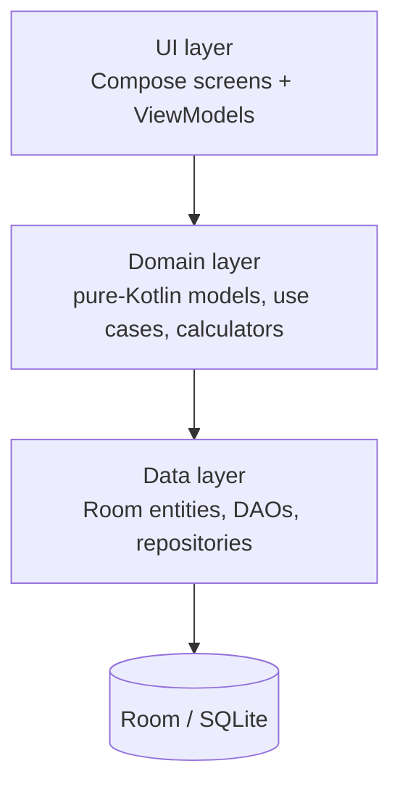

# Gymora 🏋️

**Gymora** is an offline-first Android workout tracker. Plan routines, execute workouts with fast, reliable per-set logging, and review permanent, immutable history — without ever losing or mutating a recorded session.

The core promise is a **plan → do → save → review** loop that stays fast and dependable during a real gym session, and that survives crashes, process death, and battery loss.

---

## Table of contents

- [Features](#features)
- [Tech stack](#tech-stack)
- [Architecture](#architecture)
- [Project structure](#project-structure)
- [Requirements](#requirements)
- [Getting started](#getting-started)
- [Build & run](#build--run)
- [Testing](#testing)
- [Documentation](#documentation)
- [Roadmap](#roadmap)
- [License](#license)

---

## Features

- **Exercise library** — 30+ seeded exercises grouped by muscle group (Chest, Back, Shoulders, Arms, Legs), plus search and fully custom exercises.
- **Routines** — create, edit, duplicate, and reorder workout templates with planned sets (target reps × weight) and per-exercise notes.
- **Workout execution** — one-tap START, live duration timer, immediate per-set persistence, decimal weights, extra sets, and add-on-the-fly exercises ("add to routine" vs. "this workout only").
- **Crash recovery** — an active workout always survives a restart; resume exactly where you left off with the correct elapsed time.
- **Immutable history** — every completed workout is stored permanently with name snapshots, so renaming/deleting routines or exercises never changes what history displays.
- **Previous-performance pre-fill** — your last performance for each exercise is shown and pre-fills today's sets, dramatically reducing typing.
- **Exercise history** — full, newest-first performance history for any single exercise.
- **Rest timer** — configurable countdown (30s / 60s / 90s / 2 min / 3 min / custom) with Skip, +30s, and Restart.
- **Settings** — weight unit (kg / lb), default rest duration, and theme (System / Light / Dark).
- **Personal records** — heaviest lift, most reps, estimated 1RM, and largest workout volume, computed automatically.

---

## Tech stack

| Concern      | Technology |
|--------------|------------|
| Language     | Kotlin 2.0 (JVM target 17) |
| UI           | Jetpack Compose + Material 3 |
| Navigation   | AndroidX Navigation Compose |
| Persistence  | Room (SQLite) |
| DI           | Hilt |
| Async        | Kotlin Coroutines + Flow |
| Code quality | Detekt |

The app is **offline-first** — zero network, no accounts, no telemetry. All data lives in a local Room database, which is designed as the source of truth a future sync layer can sit above.

---

## Architecture

Gymora follows a clean, layered architecture with dependencies pointing inward:



- **UI (`ui/`)** — Compose screens and navigation, organized by feature (`home`, `library`, `routines`, `workout`, `history`, `records`, `settings`).
- **Domain (`domain/`)** — pure-Kotlin, Android-free business logic: domain models, use cases, and calculators (volume, duration, 1RM). Fully unit-testable.
- **Data (`data/`)** — Room entities, DAOs, and repository implementations that map between Room entities and domain models.
- **DI (`di/`)** — Hilt modules wiring repositories and the database.

A key design principle (from the product requirements) is the strict separation between **templates** (routines, editable intent) and **historical records** (workout sessions, immutable). History is protected by **name snapshots**, so editing or deleting a routine/exercise never mutates past workouts.

---

## Project structure

```
gymora/
├── app/
│   └── src/
│       ├── main/
│       │   ├── java/com/gymora/
│       │   │   ├── data/            # Room entities, DAOs, repositories
│       │   │   ├── di/              # Hilt modules
│       │   │   ├── domain/          # models, use cases, calculators
│       │   │   └── ui/              # Compose screens, navigation, theme
│       │   └── res/                 # Android resources
│       ├── test/                    # JVM unit + Robolectric/Room integration tests
│       └── androidTest/             # Compose UI tests
├── config/detekt/                   # Detekt configuration
├── docs/                            # Product requirements
├── gradle/                          # Version catalog + wrapper
├── schemas/                         # Exported Room schemas (migration tests)
└── specs/001-workout-tracker/       # Feature spec, plan, data model, tasks
```

---

## Requirements

- **JDK 17**
- **Android Studio** (latest stable) with the Android SDK
- **Android SDK**: compile/target SDK 36, `minSdk` 26 (Android 8.0)
- A device or emulator (API 26+) for UI tests; JVM tests run without one
- No network required

---

## Getting started

1. Clone the repository:

   ```bash
   git clone <repo-url> && cd gymora
   ```

2. Open the project in Android Studio and let Gradle sync, or build from the command line:

   ```bash
   ./gradlew :app:assembleDebug
   ```

3. Run on a connected device or emulator:

   ```bash
   ./gradlew :app:installDebug
   ```

---

## Build & run

```bash
./gradlew :app:assembleDebug                # Build the debug APK
./gradlew :app:installDebug                 # Install on a connected device/emulator
./gradlew :app:testDebugUnitTest            # Run JVM unit tests
./gradlew :app:connectedDebugAndroidTest    # Run instrumented/UI tests
./gradlew detekt                            # Run static analysis
```

---

## Testing

Gymora has a four-layer test strategy:

| Layer | Location | Technology | Covers |
|-------|----------|------------|--------|
| Unit | `app/src/test/` | JUnit | Domain logic and calculators (volume, duration, 1RM) |
| Integration | `app/src/test/` | Robolectric + Room | Repositories and DAOs on the JVM |
| Migration | `app/src/test/` | Room testing | Schema migrations (`*MigrationTest`) |
| UI | `app/src/androidTest/` | Compose UI Test | End-to-end screen journeys |

Run migration tests specifically with:

```bash
./gradlew :app:testDebugUnitTest --tests "*MigrationTest*"
```

---

## Documentation

- **[docs/prod_requirements.md](docs/prod_requirements.md)** — the source product requirements.
- **[specs/001-workout-tracker/](specs/001-workout-tracker/)** — feature specification, implementation plan, data model, contracts, and tasks, produced via the SpecKit workflow:
  - `spec.md` — user stories, acceptance criteria, business rules, constraints.
  - `plan.md` — technical approach and constitution check.
  - `data-model.md` — Room entity schema.
  - `quickstart.md` — end-to-end validation guide.
  - `tasks.md` — dependency-ordered implementation tasks.

---

## Roadmap

v1 is scoped to the offline plan → do → save → review loop. The architecture is intentionally structured so that future capabilities can be added without rewriting the core:

- Cloud sync (the local Room database is the source of truth a sync layer can sit above)
- Authentication & accounts
- Analytics
- AI recommendations
- Progress charts
- Social features

---

## License

_TBD — add a license file and reference it here._
