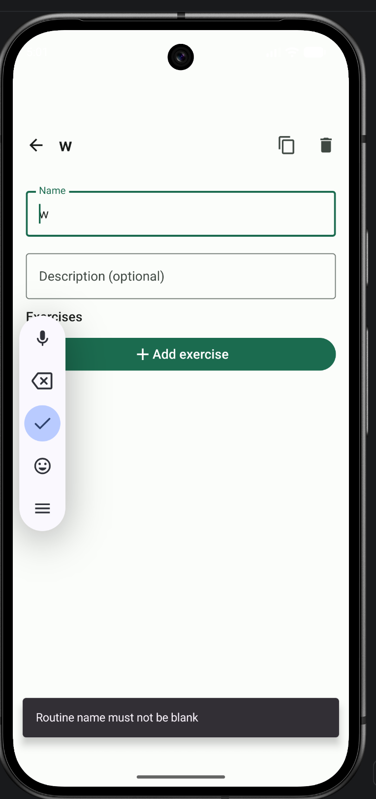
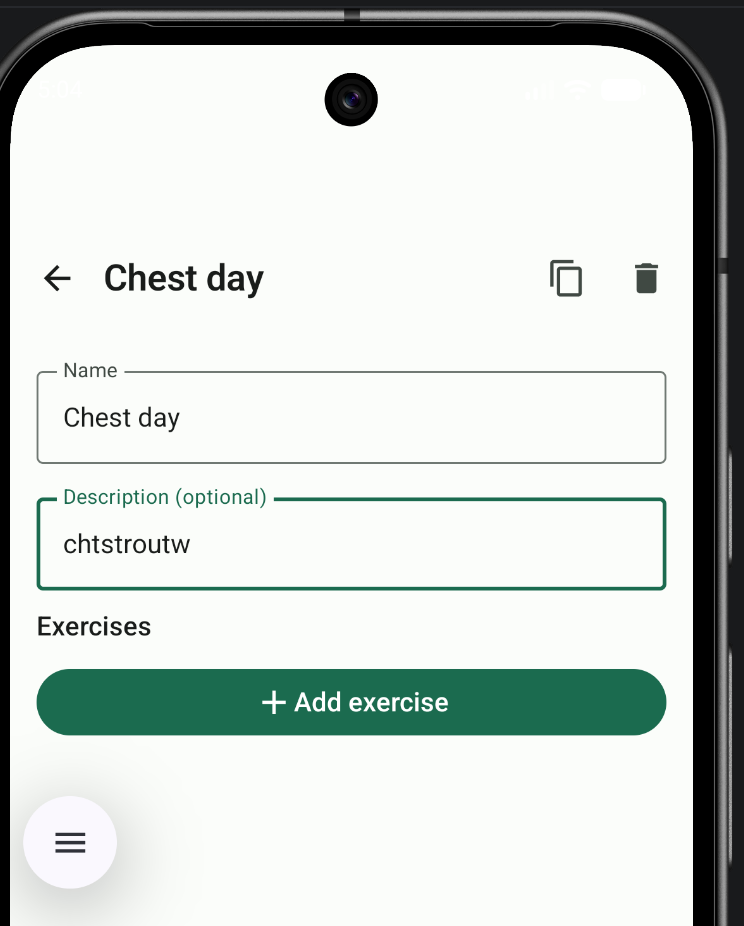

- Routine name: cannot remove the last character. Backspace works and remove every character except the last one. Error message "Routine name must not be blank"

- Routine Description screen: Places input characters randomly. Input characters don't show up correctly. See the image , I was trying to write "chest workout". Similarly backspace doesn't work properly 

- Home page is where    menu is like My Routine, Recent Workouts etc. WHen home button is pressed take the user to this page not the history page. 

- When + button is clicked, user should get the option (in a fly pop up) whether to create a new routine or a new exercise. 

- 