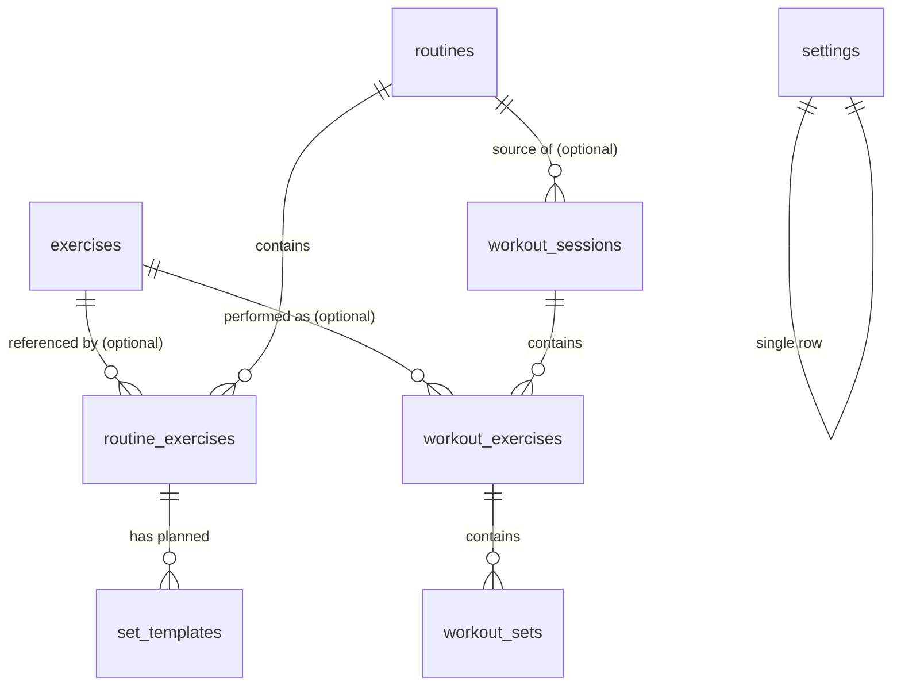

# Phase 1 Data Model: Workout Planning, Execution & History Tracking (v1)

**Branch**: `001-workout-tracker` | **Date**: 2026-09-02

Room (SQLite) schema for the Gymora v1 app. Entities are split into **template entities**
(editable intent) and **historical entities** (immutable records) per FR-055, with name
snapshots per FR-056. All IDs are robust unique identifiers (auto-generated `Long` primary
keys). Ordering is preserved via explicit `position` columns. Decisions referenced as R-xx
are from `research.md`.

## Entity overview



Layered note: Room entities live in `data/local/entity`; pure-Kotlin domain models in
`domain/model` mirror them without persistence annotations; repositories map between the
two (plan.md Structure Decision).

---

## Template entities (editable intent — BR-01)

### `exercises` — Exercise library entry (FR-005..FR-010, BR-04/08/20)

| Column | Type | Constraints | Notes |
|--------|------|-------------|-------|
| `id` | INTEGER | PK, autoGenerate | Robust unique id |
| `name` | TEXT | NOT NULL | Not unique (spec Assumption) |
| `muscle_group` | TEXT | NULLABLE | One of `CHEST`, `BACK`, `SHOULDERS`, `ARMS`, `LEGS`; NULL for custom without group |
| `description` | TEXT | NULLABLE | |
| `notes` | TEXT | NULLABLE | |
| `is_custom` | INTEGER (bool) | NOT NULL, default 0 | Built-in (seeded) vs user-created |
| `deleted_at` | INTEGER (epoch ms) | NULLABLE | Soft delete (R-03); NULL = active |
| `created_at` | INTEGER (epoch ms) | NOT NULL | |
| `updated_at` | INTEGER (epoch ms) | NOT NULL | |

- **Validation**: name non-blank (app layer, FR-006); muscle group restricted to the enum
  set when present.
- **Indexes**: partial index on `deleted_at IS NULL` + `name` for library browse/search
  (FR-008, R-07).
- **Rules**: soft-deleted rows stay queryable by id for historical joins but are excluded
  from library listing, search results, and routine pickers (R-03).

### `routines` — Workout template header (FR-011..FR-015)

| Column | Type | Constraints | Notes |
|--------|------|-------------|-------|
| `id` | INTEGER | PK, autoGenerate | |
| `name` | TEXT | NOT NULL | Not unique; duplicates allowed |
| `description` | TEXT | NULLABLE | Optional (FR-011) |
| `position` | INTEGER | NOT NULL | Home-screen order (FR-015, R-10); contiguous, transactional renumber |
| `created_at` | INTEGER (epoch ms) | NOT NULL | |
| `updated_at` | INTEGER (epoch ms) | NOT NULL | |

- **Validation**: name non-blank.
- **Indexes**: `position` (home ordering).
- **Rules**: never seeded (BR-20). Deletion cascades to its template rows only
  (`routine_exercises`, `set_templates`); historical sessions keep `routine_id` SET NULL +
  snapshot (R-03).

### `routine_exercises` — Ordered routine↔exercise link (FR-016, FR-017)

| Column | Type | Constraints | Notes |
|--------|------|-------------|-------|
| `id` | INTEGER | PK, autoGenerate | |
| `routine_id` | INTEGER | NOT NULL, FK → `routines.id` ON DELETE CASCADE | |
| `exercise_id` | INTEGER | NOT NULL, FK → `exercises.id` | Soft-deleted exercises are removed from templates with confirmation (R-03) |
| `position` | INTEGER | NOT NULL | Order within routine (FR-016) |
| `notes` | TEXT | NULLABLE | Per-exercise notes (FR-017) |

- **Constraints**: UNIQUE(`routine_id`, `position`).
- **Indexes**: (`routine_id`, `position`).

### `set_templates` — Planned sets (FR-018)

| Column | Type | Constraints | Notes |
|--------|------|-------------|-------|
| `id` | INTEGER | PK, autoGenerate | |
| `routine_exercise_id` | INTEGER | NOT NULL, FK → `routine_exercises.id` ON DELETE CASCADE | |
| `set_number` | INTEGER | NOT NULL | 1-based, contiguous per parent |
| `target_reps` | INTEGER | NOT NULL | ≥ 0 whole number (BR-16) |
| `target_weight` | REAL | NULLABLE | ≥ 0 with decimals (FR-024); NULL or 0 = bodyweight intent |
| `target_weight_unit` | TEXT | NULLABLE | `KG` \| `LB`; NULL when no weight (R-04) |
| `measurement_type` | TEXT | NOT NULL, default `WEIGHT_AND_REPS` | `WEIGHT_AND_REPS` \| `REPS_ONLY` (BR-17, R-11) |

- **Constraints**: UNIQUE(`routine_exercise_id`, `set_number`).
- **Indexes**: (`routine_exercise_id`, `set_number`).

---

## Historical entities (immutable records — BR-01, BR-11)

### `workout_sessions` — One gym session (FR-019, FR-034, FR-056)

| Column | Type | Constraints | Notes |
|--------|------|-------------|-------|
| `id` | INTEGER | PK, autoGenerate | |
| `routine_id` | INTEGER | NULLABLE, FK → `routines.id` ON DELETE SET NULL | Source routine; NULL after routine deletion or ad-hoc sessions (R-03) |
| `routine_name_snapshot` | TEXT | NOT NULL | Routine name at workout time (FR-043/056) |
| `started_at` | INTEGER (epoch ms) | NOT NULL | Start timestamp (FR-019) |
| `ended_at` | INTEGER (epoch ms) | NULLABLE | Set on finish (FR-034); NULL while active |
| `status` | TEXT | NOT NULL | `ACTIVE` \| `COMPLETED` (R-12) |
| `notes` | TEXT | NULLABLE | Workout-level notes (FR-042) |
| `created_at` | INTEGER (epoch ms) | NOT NULL | |

- **State transitions** (R-12):
  ```
  START tapped ──> ACTIVE ──FINISH confirmed──> COMPLETED   (terminal; appears in history)
                     │
                     └────Discard confirmed────> row deleted permanently (BR-15; never in history)
  ```
  No other transitions. COMPLETED rows are only mutated by explicit historical correction
  (FR-042), which never changes `status`.
- **Constraints**: partial UNIQUE index on `status = 'ACTIVE'` — enforces at most one
  active session at the persistence layer (BR-14, Constitution V).
- **Indexes**: (`status`), (`started_at` DESC) for history listing (FR-040, R-07).

### `workout_exercises` — Exercise as performed (FR-055, FR-056)

| Column | Type | Constraints | Notes |
|--------|------|-------------|-------|
| `id` | INTEGER | PK, autoGenerate | |
| `session_id` | INTEGER | NOT NULL, FK → `workout_sessions.id` ON DELETE CASCADE | |
| `exercise_id` | INTEGER | NULLABLE, FK → `exercises.id` | Optional reference (soft-deleted exercises still resolvable); NULL tolerated |
| `exercise_name_snapshot` | TEXT | NOT NULL | Name at workout time (FR-043/056) |
| `position` | INTEGER | NOT NULL | Order within session |
| `notes` | TEXT | NULLABLE | |

- **Constraints**: UNIQUE(`session_id`, `position`).
- **Indexes**: (`session_id`, `position`); (`exercise_id`) for exercise history (FR-044, R-07).

### `workout_sets` — Set as performed (FR-023, FR-024, FR-025)

| Column | Type | Constraints | Notes |
|--------|------|-------------|-------|
| `id` | INTEGER | PK, autoGenerate | |
| `workout_exercise_id` | INTEGER | NOT NULL, FK → `workout_exercises.id` ON DELETE CASCADE | |
| `set_number` | INTEGER | NOT NULL | 1-based per parent |
| `reps` | INTEGER | NULLABLE | Whole number ≥ 0 when entered (BR-16); NULL until logged |
| `weight` | REAL | NULLABLE | Decimal ≥ 0 (FR-024); NULL until logged; 0 valid (bodyweight) |
| `weight_unit` | TEXT | NULLABLE | `KG` \| `LB` — unit the value was entered in (R-04) |
| `measurement_type` | TEXT | NOT NULL, default `WEIGHT_AND_REPS` | `WEIGHT_AND_REPS` \| `REPS_ONLY` (BR-17, R-11) |
| `is_completed` | INTEGER (bool) | NOT NULL, default 0 | Completion flag (FR-025) |
| `completed_at` | INTEGER (epoch ms) | NULLABLE | Completion timestamp |
| `notes` | TEXT | NULLABLE | |

- **Constraints**: UNIQUE(`workout_exercise_id`, `set_number`).
- **Indexes**: (`workout_exercise_id`, `set_number`).
- **Validation (app layer, BR-16)**: weight ≥ 0 (decimals allowed); reps ≥ 0 integer;
  negative values rejected; zero weight allowed.
- **Derived values** (computed, never stored — BR-12/13, R-09):
  - set volume = `weight × reps` for completed sets with weight > 0
  - session duration = `ended_at − started_at`
  - estimated 1RM = Epley `weight × (1 + reps/30)` (completed weighted sets, reps ≥ 1)

---

## Settings (FR-048..FR-051)

### `settings` — Single-row preferences

| Column | Type | Constraints | Notes |
|--------|------|-------------|-------|
| `id` | INTEGER | PK, fixed value 1 | Single-row table |
| `weight_unit` | TEXT | NOT NULL, default `KG` | `KG` \| `LB` (FR-048) |
| `default_rest_seconds` | INTEGER | NOT NULL, default 90 | FR-031/FR-050; presets 30/60/90/120/180 or custom |
| `theme` | TEXT | NOT NULL, default `SYSTEM` | `SYSTEM` \| `LIGHT` \| `DARK` (FR-051) |
| `updated_at` | INTEGER (epoch ms) | NOT NULL | |

- Stored in the Room database, not SharedPreferences (FR-054 — important data must not
  live in lightweight preferences).

---

## Seed data (FR-005, BR-20, SC-008; R-08)

On first database creation, a transactional seeder inserts **30+ built-in exercises**
(`is_custom = 0`) across the five muscle groups. Indicative distribution (final wording is
implementation detail, counts are the SC-008 contract):

| Muscle group | Examples | Count |
|--------------|----------|-------|
| Chest | Bench Press, Incline Bench Press, Incline Dumbbell Press, Chest Fly, Push-Up, Dips (chest), Cable Crossover | ≥ 6 |
| Back | Deadlift, Pull-Up, Lat Pulldown, Barbell Row, Seated Cable Row, Hyperextension | ≥ 6 |
| Shoulders | Overhead Press, Dumbbell Shoulder Press, Lateral Raise, Front Raise, Face Pull, Rear Delt Fly | ≥ 6 |
| Arms | Bicep Curl, Hammer Curl, Tricep Pushdown, Skull Crusher, Preacher Curl, Dip (triceps) | ≥ 6 |
| Legs | Squat, Leg Press, Romanian Deadlift, Leg Curl, Leg Extension, Calf Raise, Lunge | ≥ 7 |

Routines are never seeded (FR-010).

## Migration policy (BR-19, FR-057, Constitution V)

- Version 1 is the initial schema above. Every future schema change ships as an explicit,
  additive-preferred Room `Migration` covered by migration tests; destructive fallback is
  never configured.
- The `measurement_type` columns are the extensibility seam for future `DURATION` /
  `DISTANCE` types (R-11): new values + optional nullable columns = non-destructive.
